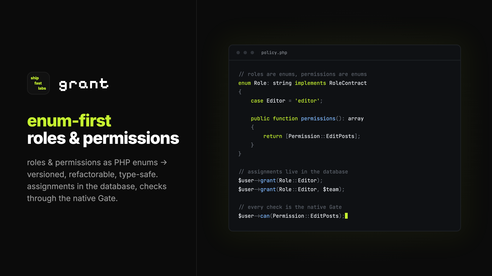

# Grant

<p align="center">
    
</p>

<p align="center">
    <a href="https://github.com/shipfastlabs/grant/actions"></a>
    <a href="https://packagist.org/packages/shipfastlabs/grant"></a>
    <a href="https://packagist.org/packages/shipfastlabs/grant"></a>
</p>

- [Introduction](#introduction)
- [Installation](#installation)
    - [Publishing Resources](#publishing-resources)
- [Defining Permissions and Roles](#defining-permissions-and-roles)
    - [Permissions](#permissions)
    - [Roles](#roles)
    - [Inheriting Permissions](#inheriting-permissions)
    - [Renaming and Removing Roles](#renaming-and-removing-roles)
- [Assigning Roles](#assigning-roles)
    - [Preparing Your User Model](#preparing-your-user-model)
    - [Granting and Revoking Roles](#granting-and-revoking-roles)
    - [Scoped Roles](#scoped-roles)
    - [Caching](#caching)
    - [The Grant Facade](#the-grant-facade)
- [Authorizing Actions](#authorizing-actions)
    - [Via the Gate](#via-the-gate)
    - [Via Policies](#via-policies)
    - [Super Admins](#super-admins)
- [Configuration](#configuration)
    - [Customizing the Assignment Model](#customizing-the-assignment-model)
    - [UUID and ULID Keys](#uuid-and-ulid-keys)
- [Artisan Commands](#artisan-commands)
- [Managing Roles in Filament](#managing-roles-in-filament)
- [Testing](#testing)
- [Development](#development)
- [Credits](#credits)

## Introduction

Grant provides minimal, enum-first roles and permissions for Laravel. Permissions are a PHP enum, roles are a PHP enum, assignments belong to any Eloquent model, and every authorization check uses Laravel's native Gate:

```php
$user->grant(Role::Editor);

$user->can(Permission::EditPosts);
```

Because definitions live in code, they are versioned, refactorable, and type-safe. Only assignments live in the database. Grant ships no check API of its own, so removing the package leaves every `can` call in your application valid.

Grant requires PHP 8.3+ and Laravel 12 or 13.

## Installation

You may install Grant via the Composer package manager:

```shell
composer require shipfastlabs/grant
```

Next, run the `grant:install` Artisan command. This command publishes Grant's configuration file and migration, then creates starter `app/Enums/Permission.php` and `app/Enums/Role.php` enums if they do not exist yet:

```shell
php artisan grant:install

php artisan migrate
```

Finally, add the `Shipfastlabs\Grant\HasRoles` trait to your `User` model, or to any Eloquent model that should hold roles.

### Publishing Resources

The install command publishes everything you need. If you would like to publish an individual resource, you may use the `vendor:publish` Artisan command with one of Grant's publish tags:

```shell
php artisan vendor:publish --tag=grant-config
php artisan vendor:publish --tag=grant-migrations
```

## Defining Permissions and Roles

### Permissions

Permissions are the abilities your application checks. They are defined as a string-backed enum that implements the `Shipfastlabs\Grant\Ability` interface. The interface requires a `deniedMessage` method, which Grant passes to the Gate's denial response:

```php
<?php

namespace App\Enums;

use Shipfastlabs\Grant\Ability;

enum Permission: string implements Ability
{
    case EditPosts = 'edit-posts';
    case DeletePosts = 'delete-posts';
    case ViewReports = 'view-reports';

    public function deniedMessage(): string
    {
        return match ($this) {
            self::EditPosts => 'You need editor access to change posts.',
            default => 'You are not allowed to do that.',
        };
    }
}
```

Each case's backing value is the ability string registered with the Gate, so `Permission::EditPosts` and `'edit-posts'` refer to the same ability.

### Roles

Roles group permissions for assignment. They are a string-backed enum that implements the `Shipfastlabs\Grant\Role` interface, which requires a `permissions` method returning the permissions the role holds:

```php
<?php

namespace App\Enums;

use Shipfastlabs\Grant\Role as RoleContract;

enum Role: string implements RoleContract
{
    case Admin = 'admin';
    case Editor = 'editor';
    case Viewer = 'viewer';

    public function permissions(): array
    {
        return match ($this) {
            self::Admin => Permission::cases(),
            self::Editor => [Permission::EditPosts, Permission::DeletePosts],
            self::Viewer => [Permission::ViewReports],
        };
    }
}
```

> [!NOTE]
> Roles are for assigning and permissions are for checking. Grant intentionally provides no `role:` middleware or `@role` Blade directive. If you need to gate on a role, add a permission to it instead.

### Inheriting Permissions

Grant has no role hierarchy feature because PHP already provides one. Since `permissions` returns an array, you may spread another role's permissions into a case to build one role on top of another:

```php
public function permissions(): array
{
    return match ($this) {
        self::Admin => Permission::cases(),
        self::Editor => [
            Permission::EditPosts,
            Permission::DeletePosts,
            ...self::Viewer->permissions(),
        ],
        self::Viewer => [Permission::ViewReports],
    };
}
```

The `Editor` role now holds every `Viewer` permission in addition to its own. Grant removes duplicate permissions when resolving a user's abilities, so overlapping lists are harmless.

### Renaming and Removing Roles

Only a role's backing value is stored in the database, so renaming a case while keeping its value, or renaming any permission, requires no data changes. Changing a role's value or removing a case leaves stored assignments that no longer match the enum. Grant ignores those rows when resolving roles, so affected users silently lose the role rather than triggering an error.

After changing the enum, run the `grant:sync` Artisan command. It lists every stored value without a matching case and asks what each one should become:

```shell
php artisan grant:sync
```

```
 Stored role [admin] no longer exists. What should its 12 assignments become?
 › administrator
   editor
   viewer
   Delete them
```

Assignments are remapped or deleted immediately. If a user already holds the target role in the same scope, the orphaned row is simply removed. When run with `--no-interaction`, the command only reports orphaned values and exits with a failure status, which makes it a convenient deployment check:

```shell
php artisan grant:sync --no-interaction
```

## Assigning Roles

### Preparing Your User Model

Add the `Shipfastlabs\Grant\HasRoles` trait to your `User` model. Grant resolves the user model from your `auth.providers.users.model` configuration, so any class configured there will work:

```php
<?php

namespace App\Models;

use Illuminate\Foundation\Auth\User as Authenticatable;
use Shipfastlabs\Grant\HasRoles;

class User extends Authenticatable
{
    use HasRoles;
}
```

Assignments are stored in the `role_assignments` table with a `user_id` foreign key that cascades on delete, so removing a user removes their assignments at the database level. The trait also provides a `roleAssignments` relationship for direct access to those rows:

```php
$user->roleAssignments; // Collection<RoleAssignment>
```

> [!NOTE]
> Grant supports a single user model. If your application authenticates several models on different guards, only the model configured as the default users provider may hold roles.

### Granting and Revoking Roles

The trait provides a small set of methods for managing a user's roles:

```php
use App\Enums\Role;

$user->grant(Role::Editor);

$user->revoke(Role::Editor);

$user->syncRoles([Role::Editor, Role::Viewer]);
```

You may inspect the roles and permissions a user currently holds:

```php
$user->hasRole(Role::Admin);

$user->roles(); // Collection<Role>

$user->permissions(); // Collection<Permission>
```

Permissions are always derived from roles at call time, so there is nothing to cache or invalidate. Enum values are the ability strings, which makes them convenient to share with your frontend:

```php
'permissions' => $user->permissions()->map->value,
```

### Scoped Roles

A role may be granted globally or scoped to any persisted Eloquent model, such as a team or project. To scope a role, pass the model as the `on` argument:

```php
$user->grant(Role::Admin, on: $team);

$user->revoke(Role::Admin, on: $team);

$user->syncRoles([Role::Admin], on: $team);

$user->roles(on: $team);
```

When authorizing with a scope, Grant resolves the roles held on that model and falls back to the user's global roles. A scoped check never grants less than an unscoped check would:

```php
$user->can(Permission::EditPosts, $team);

$user->permissions(on: $team);
```

### Caching

Grant reads a user's assignments from the database once per request and answers every later `roles`, `hasRole`, `permissions`, and `can` call for that user from memory, whether global or scoped. A page that authorizes fifty models in a loop costs one query, and no eager loading is needed.

The memo lives only for the current request. Under Octane it is cleared per request and in queue workers per job, so it never leaks between users or jobs. Granting, revoking, or syncing roles through Grant, and saving or deleting a `RoleAssignment` model, clear the affected user. Only bulk query builder writes bypass it. After one of those, or whenever you want a fresh read, flush explicitly:

```php
use Shipfastlabs\Grant\Facades\Grant;

Grant::flush($user); // one user

Grant::flush();      // everyone
```

Grant does not cache across requests. Definitions already live in code, so the only thing left to cache would be one indexed query per user per request.

### The Grant Facade

The `Grant` facade exposes the same assignment operations for situations where calling a method on the model is not convenient. The facade never performs authorization checks:

```php
use Shipfastlabs\Grant\Facades\Grant;

Grant::grant($user, Role::Editor);
Grant::revoke($user, Role::Editor);
Grant::syncRoles($user, [Role::Viewer]);
Grant::hasRole($user, Role::Editor);
```

## Authorizing Actions

### Via the Gate

At boot, Grant defines a Gate ability for every case of your permission enum. There is no package-specific check API. Instead, you use each of Laravel's authorization features as you normally would:

```php
use App\Enums\Permission;
use Illuminate\Support\Facades\Gate;

$user->can(Permission::EditPosts);

Gate::allows(Permission::EditPosts);

Gate::authorize(Permission::DeletePosts); // throws with deniedMessage()

Gate::inspect(Permission::EditPosts)->message();
```

```blade
@can(Permission::EditPosts)
    <x-edit-button />
@endcan
```

```php
Route::put('/posts/{post}', UpdatePostController::class)
    ->can(Permission::EditPosts);

Route::middleware('can:edit-posts')->group(function () {
    // ...
});
```

Form requests and controller authorization work the same way:

```php
public function authorize(): bool
{
    return $this->user()->can(Permission::EditPosts);
}
```

### Via Policies

Policies continue to own model-level context such as ownership and status. Grant supplies the capability and your policy adds the context:

```php
public function update(User $user, Post $post): bool
{
    return $user->can(Permission::EditPosts)
        && $post->author_id === $user->id;
}
```

The `Shipfastlabs\Grant\Requires` attribute removes the repeated capability check. When a policy method carries the attribute, the Gate denies the action unless the user holds the given permission, then runs the policy method as usual:

```php
use Shipfastlabs\Grant\Requires;

#[Requires(Permission::EditPosts)]
public function update(User $user, Post $post): bool
{
    return $post->author_id === $user->id;
}
```

The Gate arguments are forwarded to the permission check, so `#[Requires]` honors roles scoped to the policy's model.

### Super Admins

You may designate one role as a super admin in your configuration file. Users holding that role pass every Gate check, including policies, before any other ability is consulted:

```php
'super_admin' => App\Enums\Role::Admin,
```

Set the option to `null` to disable the bypass entirely.

Only a globally granted super admin role bypasses the Gate. Granting the role scoped to a model, such as `on: $team`, makes the user an ordinary holder of that role's permissions on that team.

## Configuration

Grant's configuration file is published to `config/grant.php` and contains four options:

```php
return [
    'roles' => App\Enums\Role::class,
    'permissions' => App\Enums\Permission::class,
    'super_admin' => null,
    'model' => Shipfastlabs\Grant\Models\RoleAssignment::class,
];
```

### Customizing the Assignment Model

Each row of the `role_assignments` table is represented by the `Shipfastlabs\Grant\Models\RoleAssignment` Eloquent model, which provides `user` and `scopeable` relationships. To add relationships, query scopes, or casts of your own, extend the model and point the `model` option at your subclass:

```php
<?php

namespace App\Models;

use Shipfastlabs\Grant\Models\RoleAssignment as BaseRoleAssignment;

class RoleAssignment extends BaseRoleAssignment
{
    // ...
}
```

```php
'model' => App\Models\RoleAssignment::class,
```

Grant uses the configured model for every query it makes, including the `roleAssignments` relationship on your user model.

### UUID and ULID Keys

The published migration uses `foreignId` for the user and `nullableMorphs` for the scope. If your users use UUID or ULID primary keys, change the user column to `foreignUuid` or `foreignUlid`. If your scopes do, change the scope columns to `nullableUuidMorphs` or `nullableUlidMorphs`. Make these edits before running the migration.

## Artisan Commands

Grant provides a handful of Artisan commands for inspecting and extending your definitions:

```shell
# List every permission registered with the Gate...
php artisan grant:list

# Show a user's roles and resolved permissions...
php artisan grant:show 1
php artisan grant:show 1 --on='App\Models\Team:5'

# Remap or delete stored roles that no longer match the enum...
php artisan grant:sync
```

To add a permission or role, add a case to the enum. After adding a role, remember to map its permissions in `Role::permissions`.

## Managing Roles in Filament

Grant ships no admin panel plugin because there is nothing to manage except which roles a user holds, and Filament handles string-backed enums natively. Add a `Select` to your user resource form that reads from `roles()` and writes through `syncRoles()`:

```php
use App\Enums\Role;
use App\Models\User;
use Filament\Forms\Components\Select;

Select::make('roles')
    ->multiple()
    ->options(Role::class)
    ->dehydrated(false)
    ->afterStateHydrated(fn (Select $component, ?User $record) => $component->state(
        $record?->roles()->map->value->all() ?? [],
    ))
    ->saveRelationshipsUsing(fn (User $record, array $state) => $record->syncRoles(
        array_map(Role::from(...), $state),
    )),
```

Implement Filament's `HasLabel` interface on your role enum to control the option labels. For scoped roles, wrap the same select in a `Repeater` alongside a select for the scope model and call `syncRoles` with the `on` argument for each entry.

## Testing

To create users with roles already assigned, add a state to your `UserFactory` that grants the role after creation:

```php
public function role(Role $role, ?Model $on = null): static
{
    return $this->afterCreating(fn (User $user) => $user->grant($role, $on));
}
```

```php
$editor = User::factory()->role(Role::Editor)->create();

$admin = User::factory()->role(Role::Admin, on: $team)->create();
```

For fluent authorization assertions, add the `Shipfastlabs\Grant\Testing\InteractsWithGrant` trait to your base test case:

```php
use Shipfastlabs\Grant\Testing\InteractsWithGrant;

abstract class TestCase extends BaseTestCase
{
    use InteractsWithGrant;
}
```

The trait provides `assertCan`, `assertCannot`, and `withRole` helpers that operate on the currently authenticated user:

```php
$this->actingAs($user)
    ->assertCannot(Permission::EditPosts)
    ->withRole(Role::Editor)
    ->assertCan(Permission::EditPosts);
```

## Development

```bash
composer test
```

Please review the [contribution guide](CONTRIBUTING.md) before opening a pull request. Security issues should follow the [security policy](SECURITY.md).

## Credits

Grant is maintained by [Shipfastlabs](https://shipfastlabs.com) and released under the [MIT license](LICENSE.md).
