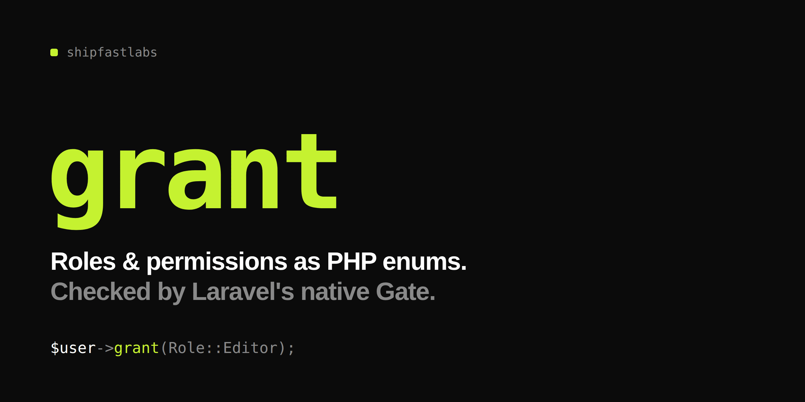

<p align="center">
    
</p>

<p align="center">
    <a href="https://github.com/shipfastlabs/grant/actions"></a>
    <a href="https://packagist.org/packages/shipfastlabs/grant"></a>
    <a href="https://packagist.org/packages/shipfastlabs/grant"></a>
</p>

## Introduction

Grant gives your Laravel app roles and permissions with almost nothing to learn. Permissions are a PHP enum. Roles are a PHP enum. Only the assignments live in the database, and every check goes through Laravel's native Gate:

```php
$user->grant(Role::Editor);

$user->can(Permission::EditPosts);
```

Grant has no check API of its own, so if you ever remove it, every `can` call in your app keeps working.

## Installation

Grant requires PHP 8.3+ and Laravel 12 or 13.

```shell
composer require shipfastlabs/grant

php artisan grant:install
php artisan migrate
```

The install command publishes the config and migration, and creates starter `app/Enums/Permission.php` and `app/Enums/Role.php` enums if you don't have them yet.

Then add the `HasRoles` trait to your user model:

```php
use Shipfastlabs\Grant\HasRoles;

class User extends Authenticatable
{
    use HasRoles;
}
```

## Quick Start

### Define permissions

A permission is a string-backed enum that implements `Ability`. Each case's value is the ability name registered with the Gate.

```php
namespace App\Enums;

use Shipfastlabs\Grant\Ability;

enum Permission: string implements Ability
{
    case EditPosts = 'edit-posts';
    case DeletePosts = 'delete-posts';
    case ViewReports = 'view-reports';

    public function deniedMessage(): string
    {
        return 'You are not allowed to do that.';
    }
}
```

### Define roles

A role is a string-backed enum that implements `Role` and lists the permissions it holds.

```php
namespace App\Enums;

use Shipfastlabs\Grant\Role as RoleContract;

enum Role: string implements RoleContract
{
    case Admin = 'admin';
    case Editor = 'editor';
    case Viewer = 'viewer';

    public function permissions(): array
    {
        return match ($this) {
            self::Admin => Permission::cases(),
            self::Editor => [Permission::EditPosts, Permission::DeletePosts],
            self::Viewer => [Permission::ViewReports],
        };
    }
}
```

> [!NOTE]
> Roles are for assigning, permissions are for checking. Grant intentionally has no `role:` middleware or `@role` directive. If you need to gate on a role, give it a permission.

Since `permissions` returns an array, one role can build on another with a plain spread:

```php
self::Editor => [
    Permission::EditPosts,
    ...self::Viewer->permissions(),
],
```

### Assign roles

```php
$user->grant(Role::Editor);
$user->revoke(Role::Editor);
$user->syncRoles([Role::Editor, Role::Viewer]);

$user->hasRole(Role::Admin);
$user->roles();       // Collection<Role>
$user->permissions(); // Collection<Permission>
```

### Check permissions

Use Laravel's authorization features exactly as you already do:

```php
$user->can(Permission::EditPosts);

Gate::authorize(Permission::DeletePosts);
```

```blade
@can(Permission::EditPosts)
    <x-edit-button />
@endcan
```

```php
Route::put('/posts/{post}', UpdatePostController::class)
    ->can(Permission::EditPosts);
```

That's it. The rest of this document covers the optional extras.

## Scoped Roles

Pass any Eloquent model as `on` to scope a role to a team, project, or anything else:

```php
$user->grant(Role::Admin, on: $team);
$user->revoke(Role::Admin, on: $team);
$user->syncRoles([Role::Admin], on: $team);

$user->roles(on: $team);
$user->permissions(on: $team);

$user->can(Permission::EditPosts, $team);
```

A scoped check also includes the user's global roles, so it never grants less than an unscoped check.

## Policies

Policies keep owning model-level rules like ownership. Grant supplies the capability, your policy adds the context:

```php
public function update(User $user, Post $post): bool
{
    return $user->can(Permission::EditPosts)
        && $post->author_id === $user->id;
}
```

To skip the repeated check, add the `Requires` attribute. The Gate denies the action unless the user holds the permission, then runs your method:

```php
use Shipfastlabs\Grant\Requires;

#[Requires(Permission::EditPosts)]
public function update(User $user, Post $post): bool
{
    return $post->author_id === $user->id;
}
```

Gate arguments are forwarded, so `#[Requires]` respects roles scoped to the policy's model.

## Super Admins

Pick one role in `config/grant.php` to pass every Gate check:

```php
'super_admin' => App\Enums\Role::Admin,
```

Set it to `null` to turn the bypass off. Only a globally granted role bypasses the Gate; the same role granted `on: $team` behaves like any other role.

## Renaming and Removing Roles

Only a role's backing value is stored. Renaming a case, or any permission, needs no data changes. Changing a role's value or deleting a case leaves orphaned rows, which Grant ignores, so those users quietly lose the role.

Run `grant:sync` after changing the enum to remap or delete them:

```shell
php artisan grant:sync
```

```
 Stored role [admin] no longer exists. What should its 12 assignments become?
 › administrator
   editor
   viewer
   Delete them
```

With `--no-interaction` it only reports orphans and exits with a failure status, which makes it a handy deploy check.

## Caching

Grant loads a user's assignments once per request and answers every later `can`, `hasRole`, `roles`, and `permissions` call from memory. Authorizing fifty models in a loop costs one query.

The memo is cleared per request (and per job in queue workers, and under Octane). Granting, revoking, syncing, and saving or deleting a `RoleAssignment` clear it for you. Only bulk query-builder writes bypass it, so flush manually after those:

```php
use Shipfastlabs\Grant\Facades\Grant;

Grant::flush($user); // one user
Grant::flush();      // everyone
```

## The Grant Facade

The facade mirrors the assignment methods for places where calling the model is awkward. It never performs checks.

```php
Grant::grant($user, Role::Editor);
Grant::revoke($user, Role::Editor);
Grant::syncRoles($user, [Role::Viewer]);
Grant::hasRole($user, Role::Editor);
```

## Configuration

`config/grant.php` has four options:

```php
return [
    'roles' => App\Enums\Role::class,
    'permissions' => App\Enums\Permission::class,
    'super_admin' => null,
    'model' => Shipfastlabs\Grant\Models\RoleAssignment::class,
];
```

To add your own relationships or scopes, extend `Shipfastlabs\Grant\Models\RoleAssignment` and point `model` at your subclass.

If your users or scoped models use UUID or ULID keys, edit the published migration before running it: switch `foreignId` to `foreignUuid` or `foreignUlid`, and `nullableMorphs` to `nullableUuidMorphs` or `nullableUlidMorphs`.

Grant supports a single user model: the one set in `auth.providers.users.model`.

To publish resources individually:

```shell
php artisan vendor:publish --tag=grant-config
php artisan vendor:publish --tag=grant-migrations
```

## Artisan Commands

```shell
# List every permission registered with the Gate...
php artisan grant:list

# Show a user's roles and resolved permissions...
php artisan grant:show 1
php artisan grant:show 1 --on='App\Models\Team:5'

# Remap or delete stored roles that no longer match the enum...
php artisan grant:sync
```

To add a permission or role, add a case to the enum. For a new role, map its permissions in `Role::permissions`.

## Filament

Grant ships no admin panel plugin. Filament already handles backed enums, so a `Select` on your user resource is enough:

```php
Select::make('roles')
    ->multiple()
    ->options(Role::class)
    ->dehydrated(false)
    ->afterStateHydrated(fn (Select $component, ?User $record) => $component->state(
        $record?->roles()->map->value->all() ?? [],
    ))
    ->saveRelationshipsUsing(fn (User $record, array $state) => $record->syncRoles(
        array_map(Role::from(...), $state),
    )),
```

Implement Filament's `HasLabel` on your role enum to control the labels.

## Testing

Add a factory state to create users with roles:

```php
public function role(Role $role, ?Model $on = null): static
{
    return $this->afterCreating(fn (User $user) => $user->grant($role, $on));
}
```

```php
$editor = User::factory()->role(Role::Editor)->create();
```

For fluent assertions, use the `InteractsWithGrant` trait in your base test case:

```php
use Shipfastlabs\Grant\Testing\InteractsWithGrant;

abstract class TestCase extends BaseTestCase
{
    use InteractsWithGrant;
}
```

```php
$this->actingAs($user)
    ->assertCannot(Permission::EditPosts)
    ->withRole(Role::Editor)
    ->assertCan(Permission::EditPosts);
```

## Contributing

```shell
composer test
```

Please read the [contribution guide](CONTRIBUTING.md) first. For security issues, see the [security policy](SECURITY.md).

## Credits

Grant is maintained by [Shipfastlabs](https://shipfastlabs.com) and released under the [MIT license](LICENSE.md).
